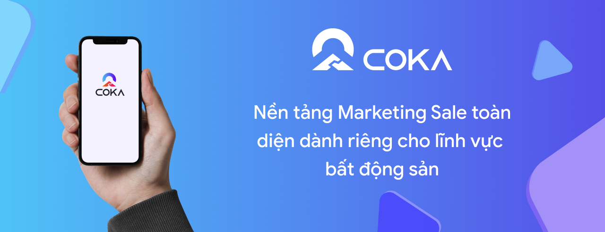

# 🔷 Bắt đầu hành trình COKA của bạn

COKA là nền tảng Marketing Sale toàn diện và bán hàng đỉnh cao chuyên biệt dành cho lĩnh vực bất động sản.

<figure><figcaption></figcaption></figure>

## Tải, cài đặt và bắt đầu cùng COKA


[tai-cai-dat-va-bat-dau-cung-coka.md](tai-cai-dat-va-bat-dau-cung-coka.md)


## Bắt đầu với vai trò

COKA có 2 vai trò là **Quản trị viên** và **Thành viên**. Bạn có thể hiểu đơn giản hơn **Quản trị viên** sẽ là chủ tổ chức và **Thành viên** là những người bên trong tổ chức. Hướng dẫn này sẽ giúp bạn bắt đầu COKA dễ dàng hơn ở bất cứ vai trò nào.

### Quản trị viên

Tất cả những gì bạn cần biết để tạo một tổ chức cũng như các bước thiết lập nhằm giúp tổ chức hoạt động một cách hợp lý và tiện lợi nhất.

<table data-card-size="large" data-column-title-hidden data-view="cards"><thead><tr><th align="center"></th><th data-hidden data-card-cover data-type="files"></th><th data-hidden data-card-target data-type="content-ref"></th></tr></thead><tbody><tr><td align="center"><strong>Bước 1</strong></td><td><a href=".gitbook/assets/Step 1 admin.jpg">Step 1 admin.jpg</a></td><td><a href="vai-tro-quan-tri-vien/buoc-1-thiet-lap-to-chuc.md">buoc-1-thiet-lap-to-chuc.md</a></td></tr><tr><td align="center"><strong>Bước 2</strong></td><td><a href=".gitbook/assets/Step 2 admin.jpg">Step 2 admin.jpg</a></td><td><a href="vai-tro-quan-tri-vien/buoc-2-tao-khong-gian-lam-viec.md">buoc-2-tao-khong-gian-lam-viec.md</a></td></tr><tr><td align="center"><strong>Bước 3</strong></td><td><a href=".gitbook/assets/Step 3 admin.jpg">Step 3 admin.jpg</a></td><td><a href="vai-tro-quan-tri-vien/buoc-3-moi-va-duyet-thanh-vien-vao-to-chuc.md">buoc-3-moi-va-duyet-thanh-vien-vao-to-chuc.md</a></td></tr><tr><td align="center"><strong>Bước 4</strong></td><td><a href=".gitbook/assets/Step 4 admin.jpg">Step 4 admin.jpg</a></td><td><a href="vai-tro-quan-tri-vien/buoc-4-phan-quyen-cho-cac-thanh-vien-ben-trong-to-chuc.md">buoc-4-phan-quyen-cho-cac-thanh-vien-ben-trong-to-chuc.md</a></td></tr><tr><td align="center"><strong>Bước 5</strong></td><td><a href=".gitbook/assets/Step 5 admin.png">Step 5 admin.png</a></td><td><a href="vai-tro-quan-tri-vien/buoc-5-tao-doi-sale.md">buoc-5-tao-doi-sale.md</a></td></tr><tr><td align="center"><strong>Bước 6</strong></td><td><a href=".gitbook/assets/Step 6 admin.png">Step 6 admin.png</a></td><td><a href="vai-tro-quan-tri-vien/buoc-6-xem-bao-cao-khong-gian-lam-viec.md">buoc-6-xem-bao-cao-khong-gian-lam-viec.md</a></td></tr></tbody></table>

### Thành viên

Tìm hiểu hướng dẫn cơ bản giúp bạn dễ dàng chăm sóc khách hàng bên trong tổ chức của mình .

<table data-card-size="large" data-view="cards"><thead><tr><th align="center"></th><th data-hidden data-card-cover data-type="files"></th><th data-hidden data-card-target data-type="content-ref"></th></tr></thead><tbody><tr><td align="center"><strong>Bước 1</strong>     </td><td><a href=".gitbook/assets/step1-user.png">step1-user.png</a></td><td><a href="vai-tro-thanh-vien/buoc-1-chinh-sua-thong-tin-ca-nhan-va-gia-nhap-to-chuc.md">buoc-1-chinh-sua-thong-tin-ca-nhan-va-gia-nhap-to-chuc.md</a></td></tr><tr><td align="center"><strong>Bước 2</strong>  </td><td><a href=".gitbook/assets/step2-user.jpg">step2-user.jpg</a></td><td><a href="vai-tro-thanh-vien/buoc-2-gia-nhap-khong-gian-lam-viec-va-bat-dau-tim-kiem-khach-hang-dau-tien-cua-ban.md">buoc-2-gia-nhap-khong-gian-lam-viec-va-bat-dau-tim-kiem-khach-hang-dau-tien-cua-ban.md</a></td></tr></tbody></table>

<table data-card-size="large" data-view="cards" data-full-width="false"><thead><tr><th align="center"></th><th data-hidden data-card-cover data-type="files"></th><th data-hidden data-card-target data-type="content-ref"></th></tr></thead><tbody><tr><td align="center"><strong>Bước 3</strong>         </td><td><a href=".gitbook/assets/step3-user (1).jpg">step3-user (1).jpg</a></td><td><a href="vai-tro-thanh-vien/buoc-3-cham-soc-theo-doi-va-quan-ly-khach-hang-voi-coka.md">buoc-3-cham-soc-theo-doi-va-quan-ly-khach-hang-voi-coka.md</a></td></tr></tbody></table>

## Sử dụng các chiến dịch của COKA

COKA giúp bạn dễ dàng tìm kiếm khách hàng cũng như phát triển tổ chức hơn. Bạn có thể nhấn và tìm hiểu các chiến dịch bên dưới của COKA.

<table data-card-size="large" data-view="cards"><thead><tr><th></th><th></th><th data-hidden data-card-cover data-type="files"></th><th data-hidden data-card-target data-type="content-ref"></th></tr></thead><tbody><tr><td><strong>Kết nối đa nguồn</strong></td><td>Kết nối đa nguồn giúp người dùng tương tác với khách hàng trên nhiều nền tảng chỉ với COKA</td><td><a href=".gitbook/assets/omniii.jpg">omniii.jpg</a></td><td><a href="chien-dich-cua-coka/ket-noi-da-nguon.md">ket-noi-da-nguon.md</a></td></tr><tr><td><strong>AI ChatBot</strong></td><td>AI Chatbot giúp người dùng tạo các kịch bản trả lời tự động một cách tự nhiên, tiết kiệm thời gian và nhân lực</td><td><a href=".gitbook/assets/aichatbox.jpg">aichatbox.jpg</a></td><td><a href="chien-dich-cua-coka/ai-chatbot.md">ai-chatbot.md</a></td></tr><tr><td><strong>Làm giàu dữ liệu</strong></td><td>Tính năng làm giàu dữ liệu tự động tìm kiếm và điền đầy đủ các thông tin khách hàng</td><td><a href=".gitbook/assets/enrichs.jpg">enrichs.jpg</a></td><td><a href="chien-dich-cua-coka/lam-giau-du-lieu.md">lam-giau-du-lieu.md</a></td></tr><tr><td><strong>Automation</strong></td><td>Automation giúp người dùng tự động thực hiện các hành động chỉ với một lần cấu hình</td><td><a href=".gitbook/assets/mationauto.jpg">mationauto.jpg</a></td><td><a href="chien-dich-cua-coka/automation.md">automation.md</a></td></tr><tr><td><strong>Tổng đài</strong></td><td>Tổng đài giúp người dùng liên lạc với khách hàng nhằm dễ dàng tư vấn, bán hàng thông qua các tính năng bên trong tổng đài</td><td><a href=".gitbook/assets/centrec.jpg">centrec.jpg</a></td><td><a href="chien-dich-cua-coka/tong-dai.md">tong-dai.md</a></td></tr><tr><td><strong>Gọi hàng loạt</strong></td><td>Gọi hàng loạt là chức năng giúp nhân viên tư vấn tiết kiệm thời gian chờ giữa những cuộc gọi, đảm bảo hiệu suất gọi cao nhất</td><td><a href=".gitbook/assets/Predictive dialer.jpg">Predictive dialer.jpg</a></td><td><a href="chien-dich-cua-coka/goi-hang-loat.md">goi-hang-loat.md</a></td></tr></tbody></table>

## Sử dụng các tiện ích khác của COKA

COKA còn có các tiện ích khác nhằm đáp ứng đầy đủ tất cả nhu cầu của người dùng

<table data-card-size="large" data-view="cards"><thead><tr><th></th><th data-hidden data-card-target data-type="content-ref"></th><th data-hidden data-card-cover data-type="files"></th></tr></thead><tbody><tr><td>
<strong>Chat đa kênh</strong>

Chat đa kênh cho phép trò chuyện từ nhiều nền tảng như Zalo, Facebook Messenger, Email, và In - app chat.
</td><td><a href="tien-ich-cua-coka/chat-da-kenh.md">chat-da-kenh.md</a></td><td><a href=".gitbook/assets/multiple chat.png">multiple chat.png</a></td></tr><tr><td>
<strong>Giỏ hàng</strong>

Giỏ hàng là tính năng cho phép gom nhiều sản phẩm vào một giỏ để quản lý tập trung và phân bổ đều đến cái không gian làm việc.
</td><td><a href="tien-ich-cua-coka/gio-hang.md">gio-hang.md</a></td><td><a href=".gitbook/assets/shoppingcart.png">shoppingcart.png</a></td></tr><tr><td>
<strong>Giao dịch</strong>

Giao dịch là nơi các trạng thái nhu cầu của sản phẩm sẽ được tập trung ở đây. Giúp quản trị viên có thể theo dõi cũng như phê duyệt các giao dịch dễ dàng hơn.
</td><td><a href="tien-ich-cua-coka/giao-dich.md">giao-dich.md</a></td><td><a href=".gitbook/assets/transcation.png">transcation.png</a></td></tr><tr><td>
<strong>Báo cáo</strong>

Báo cáo là tính năng tổng hợp và phân tích dữ liệu từ không gian làm việc, thành viên, sản phẩm, giỏ hàng, và doanh thu bên trong tổ chức.
</td><td><a href="tien-ich-cua-coka/bao-cao.md">bao-cao.md</a></td><td><a href=".gitbook/assets/reporrt.png">reporrt.png</a></td></tr></tbody></table>
