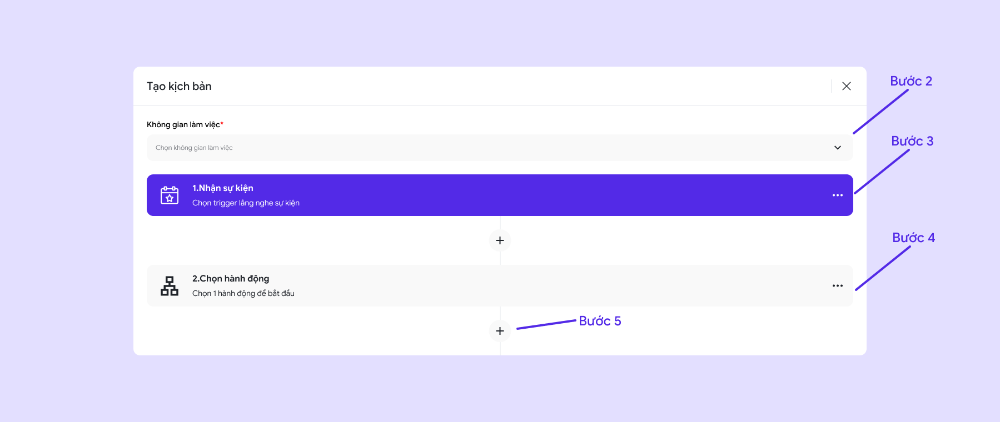
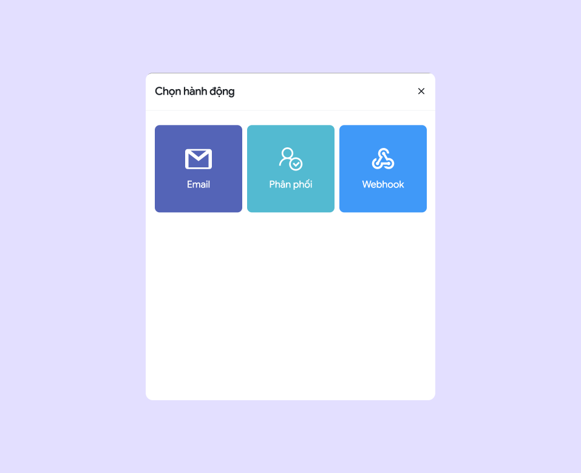

# 🔸 Automation Old

## I. Giới thiệu tính năng

Tự động hóa là tính năng cho phép người dùng thiết lập các quy trình và tác vụ chăm sóc khách hàng, bán hàng, và vận hành một cách tự động. Hệ thống này giúp giảm thiểu các thao tác thủ công, đảm bảo hoạt động diễn ra liên tục và chính xác. Nhờ tự động hóa, người dùng có thể nâng cao hiệu suất làm việc, tối ưu chi phí và thời gian.

## II. Hướng dẫn sử dụng

### 1. Tạo mới Automation

* **Bước 1:** Ấn vào nút **"Thêm mới"** để tạo mới kịch bản.

<figure><figcaption>
Thêm mới Automation
</figcaption></figure>

* **Bước 2:** Chọn **"Không gian làm việc"**

<figure><figcaption>
Màn hình Automation
</figcaption></figure>

* **Bước 3:** Chọn **trigger** cho **sự kiện**\
  **\*Trigger:** là điều kiện để kích hoạt 1 hành động nào đó.

<figure><figcaption></figcaption></figure>

\+  Có 2 loại trigger:

1. **Khách hàng**
2. **Facebook Page**

<figure><figcaption>
Khách hàng
</figcaption></figure> <figure><figcaption>
Facebook Page
</figcaption></figure>

Chọn "**1 sự kiện"** phù hợp với nhu cầu của người dùng&#x20;

* **Bước 4:** Chọn **"hành động**" để thực thi&#x20;

<figure><figcaption>
Hành động
</figcaption></figure>

**1. Hành động:** Có 3 loại: **Email, Phân phối, Webhook**

<figure><figcaption></figcaption></figure>

* **Email:**&#x20;

**+ Bước 1:** Chọn hành động **" Gửi một Email"**

**+ Bước 2:** Điền đầy đủ các thông tin cấu hình Email

**-- Tài khoản Email:** Chọn **tài khoản Email** hoặc **đăng nhập Email**.

**-- Tới:** Gửi Email tới người nhận. Nhập **địa chỉ Email người nhận**

**-- Chủ đề:** Nhập chủ đề cho Email

**-- Nội dung**: Nhập nội dung cho mail

**+ Bước 3**: Bấm hoàn tất để lưu

<figure><figcaption>
Hành động: Email
</figcaption></figure> <figure><figcaption>
Chi tiết: gửi Email.
</figcaption></figure>

* Phân phối: Có 2 loại là **phân phối tới đội Sale** và **phân phối tới các nhân viên Sale**

**+ Phân phối tới đội Sale:** Chọn các **đội Sale** mà bạn muốn sau đó chọn **tỉ lệ** cho từng **đội Sale**

**+ Phân phối tới các nhận viên Sale:** Chọn các **nhân viên** sau đó chọn **tỉ lệ** cho từng **nhân viên**

* **Webhook**

**+ Bước 1:** Chọn **phương thức**&#x20;

Trong menu thả xuống, chọn một trong các phương thức HTTP sau:

* **GET**: Lấy dữ liệu từ webhook.
* **POST**: Gửi dữ liệu đến webhook, thường dùng để tạo bản ghi mới.
* **PUT**: Cập nhật dữ liệu đã có trên webhook.
* **DELETE**: Xóa dữ liệu thông qua webhook.

**+ Bước 2: Nhập Url Webhook**

* Nhập **URL của Webhook** mà bạn muốn gửi request đến.
* Đảm bảo URL đúng và máy chủ sẵn sàng xử lý request cho phương thức HTTP đã chọn.

**+ Bước 3: Header (JSON)**

Nhập các header mà bạn muốn

hoặc chọn icon dấu **"+"** để thêm các **"nguyên liệu"** mà bạn có từ **"sự kiện"** đã tạo phía trên.&#x20;

**Chú ý:** Cần tuỳ chỉnh các header cho đúng với định dạng của JSON

**+ Bước 4: Body (nếu chọn phương thức POST, PUT)**

Nhập các header mà bạn muốn

hoặc chọn icon dấu **"+"** để thêm các **"nguyên liệu"** mà bạn có từ **"sự kiện"** đã tạo phía trên.&#x20;

**Chú ý:** Cần tuỳ chỉnh các header cho đúng với định dạng của JSON

**+ Bước 5: Ấn "Tiếp tục" để lưu**

<figure><figcaption>
Cấu hình Webhook
</figcaption></figure>

**2.Phân luồng:**&#x20;

Giúp rẽ nhánh nhằm xây dựng các trường hợp khác nhau

**3.Bộ lọc:**

**3.1 Chỉ tiếp tục khi (Condition):**

* **Chọn tham số cần so sánh**: Chọn trường dữ liệu hoặc tham số mà bạn muốn so sánh (nguyên liệu bên trong sự kiện)
* **Điều kiện so sánh**:
  * **Bằng**: So sánh giá trị trường với một giá trị chính xác.
  * **Khác**: Giá trị trường khác với giá trị so sánh.
  * **Chứa**: Trường chứa giá trị mà bạn chỉ định.
  * **Không chứa**: Trường không chứa giá trị mà bạn chỉ định.
  * **Lớn hơn**: Trường có giá trị lớn hơn giá trị so sánh.
  * **Nhỏ hơn**: Trường có giá trị nhỏ hơn giá trị so sánh.
  * **Tồn tại**: Trường tồn tại trong dữ liệu.
  * **Không tồn tại**: Trường không tồn tại trong dữ liệu.
* **Nhập nội dung so sánh**: Nhập giá trị mà bạn muốn so sánh với tham số đã chọn hoặc chọn icon dấu **"+"** để thêm các **"nguyên liệu"** mà bạn có từ **"sự kiện"** đã tạo phía trên.

**3.2 Và (AND):**

* Bạn có thể thêm nhiều điều kiện bằng cách nhấn vào nút **+ Và**. Các điều kiện được nối với nhau bằng logic "AND", nghĩa là tất cả các điều kiện này phải đúng để tiếp tục.

**3.3 Hoặc tiếp tục khi (OR):**

* Nếu bạn muốn thêm điều kiện với logic "OR" (nghĩa là chỉ cần một trong các điều kiện đúng để tiếp tục), nhấn vào nút **+ Hoặc**. Bạn có thể nhập các điều kiện giống như phần "Chỉ tiếp tục khi".

**3.4 Hoàn tất**:

* Sau khi thiết lập xong các điều kiện lọc, nhấn nút **Hoàn tất** để lưu lại và áp dụng các bộ lọc này.

<figure><figcaption>
Bộ lọc
</figcaption></figure>

* **Bước 5: (Tuỳ chọn)** ấn vào icon **"+"** để tạo thêm **hành động** mới và thực hiện như các bước trên.
* **Bước 6:** Bấm **"Hoàn thành"** để hoàn tất tạo mới kịch bản Automation

### 2. Sử dụng Automation

* Người dùng có thể ấn vào để xem chi tiết cũng như chỉnh sửa kịch bản Automation
* Người dùng ấn vào nút bật/tắt để tắt/mở kịch bản Automation

<figure><figcaption></figcaption></figure>
