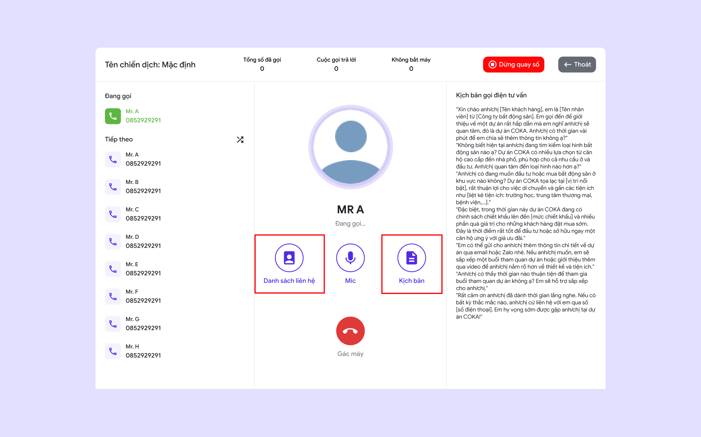

# 🔸 Gọi hàng loạt

## I. Giới thiệu tính năng

Gọi hàng loạt là tính năng tự động quay số cho nhiều liên hệ cùng lúc dựa trên danh sách có sẵn, giúp tối ưu hóa hiệu suất gọi và giảm thời gian chờ. Hệ thống phân tích thời gian rảnh của nhân viên và chỉ chuyển các cuộc gọi thành công, bỏ qua những cuộc gọi không kết nối. Tính năng này tăng cường năng suất, giúp nhân viên tập trung vào các khách hàng tiềm năng và cải thiện hiệu quả chăm sóc hoặc bán hàng.&#x20;

## II. Hướng dẫn sử dụng

## 1. Tạo mới chiến dịch

* **Bước 1:** Nhấn vào nút **"Thêm mới"**.

<figure><figcaption>
Thêm mới gọi hàng loạt
</figcaption></figure>

* **Bước 2:** Điền thông tin **"Cấu hình"**

**+** Nhập **"Tên chiến dịch"**

**+** Chọn **"Nhân viên"**

**+** Chọn **"Đầu số sử dụng"**

**+** Nhập **"Số lần gọi lại khi kết nối thất bại"**

**+** Chọn **"Đơn vị thời gian"** và cấu hình **khoảng thời gian** giữa các lần gọi

**+** Chọn **"Các tuỳ chọn bổ sung"**

**+** Nhấn **"Tiếp theo"** để sang bước kế tiếp

<figure><figcaption>
Cấu hình cho chiến dịch gọi hàng loạt
</figcaption></figure>

* **Bước 3:** Thêm **"Danh sách liên hệ"**&#x20;

\+ Nhấn vào nút **"Thêm mới"**

\+ Chọn **phương thức thêm khách hàng:**&#x20;

1. **Tạo mới khách hàng:**&#x20;

* Nhập **"Số điện thoại"**
* Nhập **"Tên khách hàng"**
* Nhập **"Ghi chú"**

2. **Thêm từ danh sách khách hàng:**

* Chọn **"không gian làm việc"**
* Chọn "**khách hàng"**

3. **Tải lên hàng loạt:**

* Sử dụng **"File Excel"** theo **mẫu** để tải lên danh sách khách hàng

<figure><figcaption>
Thêm danh sách liên hệ
</figcaption></figure>

* **Bước 4:** Thêm nội dung cho **"Kịch bản cuộc gọi"**

<figure><figcaption></figcaption></figure>

* **Bước 5:** Chọn **"Hoàn thành"** để lưu

## 2. Sử dụng&#x20;

Sau khi tạo xong bạn có thể sử dụng chức năng gọi hàng loạt.

Ấn vào chiến dịch "**Gọi hàng loạt"** bất kì.

<figure><figcaption>
Chiến dịch gọi hàng loạt
</figcaption></figure>

### 2.1 Chi tiết quay số hàng loạt

<figure><figcaption>
Giao diện quay số hàng loạt
</figcaption></figure>

* Nhấn **"Gọi ngay"** để [**thực hiện quay số hàng loạt**](goi-hang-loat.md#id-2.2-thuc-hien-quay-so-hang-loat)**.**
* Nhấn **"Cài đặt"** để tuỳ chỉnh lại các cấu hình ban đầ&#x75;**.**
* Chuyển các tabs: **"Lịch sử"**, **"Liên hệ"**, **"Kịch bản"**, **"Báo cáo"** để xem chi tiết của từng phần.

**+ Lịch sử:** Lịch sử các cuộc gọi&#x20;

* Ấn vào bất kỳ **"Lịch sử cuộc gọi"** nào để xem chi tiết.

<figure><figcaption>
Lịch sử cuộc gọi
</figcaption></figure>

**+ Liên hệ:** Danh sách liên hệ

* Ấn vào bất kỳ **"Liên hệ"** nào để xem chi tiết.
* Chọn icon **"Chỉnh sửa"** để chỉnh sửa **thông tin** cũng như thêm các **ghi chú.**
* Chọn icon **"Xoá"** để xoá liên hệ.
* Nhấn **"Thêm khách hàng"** để thêm liên hệ thành khách hàng bên trong **không gian làm việc.**

<figure><figcaption>
Danh sách liên hệ
</figcaption></figure>

**+ Kịch bản:** Kịch bản gọi điện

* Chọn **"Chỉnh sửa"** để chỉnh sửa nội dung kịch bản.

<figure><figcaption>
Kịch bản gọi điện
</figcaption></figure>

**+ Báo cáo:** Báo cáo trong chiến dịch

<figure><figcaption>
Báo cáo
</figcaption></figure>

### 2.2 Thực hiện quay số hàng loạt

* Bấm vào **"Gọi ngay"** để thực hiện quay số hàng loạt
* Chọn gọi **tự động** hoặc gọi **thủ công**

<figure><figcaption>
Quay số hàng loạt
</figcaption></figure>

* Nhấn vào **"Danh sách liên hệ"** để bật/tắt danh sách liên hệ
* Nhấn vào **"Mic"** để bật/tắt mic
* Nhấn vào **"Kịch bản"** để bật/tắt kịch bản

<figure><figcaption></figcaption></figure>

### 2.3 Báo cáo kết quả cuộc gọi

Sau khi tư vấn cuộc gọi thành công, người dùng cần phải báo cáo lại cuộc gọi

* **Thêm khách hàng:** Thêm khách hàng vào không gian làm việc
* **Trạng thái khách hàng:** Chọn các trạng thái: tiềm năng, không tiềm năng, chưa xác định.
* **Ghi chú:** Ghi chú lại những lưu ý về khách hàng
* Ấn **"Lưu & dừng gọi"** để lưu và tạm ngưng gọi hàng loạt
* Ấn **"Lưu & gọi tiếp"** để lưu và tiếp tục gọi hàng loạt

<figure><figcaption>
Kết quả cuộc gọi
</figcaption></figure>


Bạn đã xem hết các chiến dịch của COKA. Bạn có thể tìm hiểu thêm về, [vai trò quản trị viên](../vai-tro-quan-tri-vien/),  [vai trò thành viên](../vai-tro-thanh-vien/), và các [tiện ích](../tien-ich-cua-coka/) khác của COKA.

