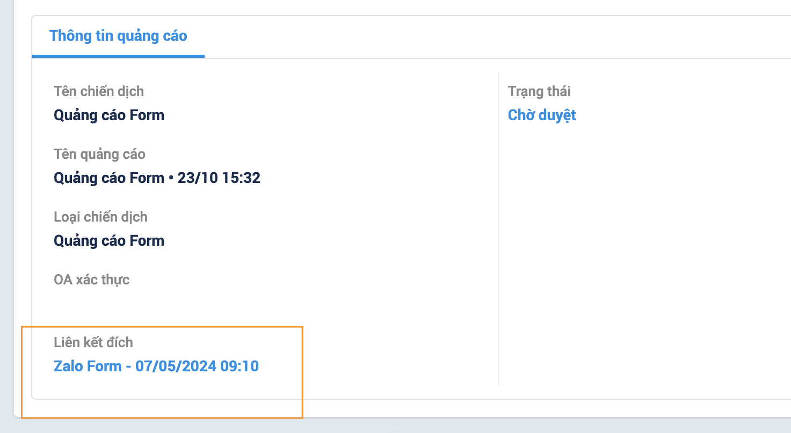

---
layout:
  title:
    visible: true
  description:
    visible: false
  tableOfContents:
    visible: true
  outline:
    visible: true
  pagination:
    visible: true
---

# 🔸 Kết nối đa nguồn

## I. Giới thiệu tính năng

Kết nối đa nguồn là tính năng cho phép đồng bộ và quản lý tất cả các kênh liên lạc từ nhiều nền tảng khác nhau trong một hệ thống duy nhất. Điều này giúp người dùng tương tác với khách hàng xuyên suốt và liên tục qua nhiều kênh như mạng xã hội, website, và ứng dụng chat mà không làm gián đoạn trải nghiệm của người dùng.

## II. Hướng dẫn sử dụng

### 1. Thêm mới kênh kết nối&#x20;

**+ Bước 1:** Ấn vào **"Thêm mới"** để tạo kênh kết nối mới

<figure><figcaption>
Màn hình kết nối đa nguồn
</figcaption></figure>

&#x20;**+Bước 2:** Chọn **"không gian làm việc"**&#x20;

<figure><figcaption>
Màn hình liên kết trang mới
</figcaption></figure>

**+ Bước 3:** Kết nối&#x20;

Ứng dụng hiện tại đang có 3 liên kết là qua Webform, Facebook Form và Zalo Form.&#x20;

#### **1.1 Web form**

**+ Bước 1:** Chọn **"Liên kết qua Web Form".**

**+ Bước 2:** Nhập địa chỉ URL website và nhấn **"Tiếp theo".**

<figure><figcaption>
Màn hình cấu hình Webform mới
</figcaption></figure>

**+ Bước 3:** Copy đoạn **script** phía dưới và dán vào giữa \<head>...\<head> của phần source website.

**+ Bước 4:** Bấm **"Xác minh"** để kiểm tra.

\*Nếu **"Xác minh"** thất bại, người dùng cần kiểm tra lại nơi gắn đoạn **script** của mình.

**+ Bước 5:** Bấm **"Lưu"** để hoàn tất liên kết.

<figure><figcaption>
Xác minh script 
</figcaption></figure>

#### **1.2 Facebook form**

**+ Bước 1:** Chọn **"Liên kết qua Facebook Form".**&#x20;

Hệ thống sẽ tự chuyển đến trang liên kết của Facebook, bạn cần chọn trang mà mình muốn liên kết để tiếp tục

<figure><figcaption>
 Chọn trang liên kết
</figcaption></figure>

**+ Bước 2:** Cấp quyền cho Facebook và bấm **"Xong"**&#x20;

**+ Bước 3:** Sau khi liên kết thành công, bấm **"OK"** để hoàn thành kết nối &#x20;

<figure><figcaption>
Liên kết thành công
</figcaption></figure>

#### **1.3 Zalo Form**

**+ Bước 1:** Chọn **"Liên kết qua Zalo Form" -> " Chọn tài khoản OA " .** Nếu chưa có tài khoản thì chọn **" Thêm tài khoản "** và đăng nhập tài khoản Zalo OA.

**+ Bước 2:** Điền "**Form Url".** Dán Url vào ô trống sau đó bấm **"Kiểm tra".**

**\*Chú ý:** Cần tạo "**Zalo ADS"** sau đó tìm phần "**thông tin quảng cáo"**, nhấn vào nội dung của **"liên kết đích"** để lấy Url.

<figure><figcaption></figcaption></figure>

**+ Bước 3:** Chọn **"Ngày hết hạn"**

**+ Bước 4:** Cấu hình **"Zalo Form",** Khi người dùng nhập địa chỉ Url thành công, hệ thống sẽ tự động điền các Field tương ứng.

<figure><figcaption>
Màn hình cấu hình Zalo form
</figcaption></figure>

### 2. Cách bật, tắt, cập nhật trạng thái cho các kênh kết nối

#### 2.1 Web Form:

Có 3 trạng thái: Đang kết nối, Ngắt kết nối, Chưa xác minh

* **Đang kết nối/ ngắt kết nối**: Ấn vào nút **Bật/Tắt** để thay đổi trạng thái từ đang kết nối thành ngắt kết nối hoặc ngược lại

<figure><figcaption>
Bật/ tắt trạng thái Web form
</figcaption></figure>

* **Chưa xác minh:** Nhấn vào nút **"Xác minh"**, sau đó cần kiểm tra lại đoạn **script** và nhấn **" Xác minh"**. Nếu thành công nút **"Xác minh"** sẽ đổi thành **"Đã xác minh".**

<figure><figcaption>
Chưa xác minh Web Form
</figcaption></figure>

<figure><figcaption>
Xác minh Web Form
</figcaption></figure>

#### 2.2 Facebook Form, Zalo Form

Có 3 trạng thái: Đang kết nối, Ngắt kết nối, mất kết nối

* **Đang kết nối/ ngắt kết nối**: Ấn vào nút **Bật/Tắt** để thay đổi trạng thái từ đang kết nối thành ngắt kết nối hoặc ngược lại
* **Mất kết nối:** Nhấn vào nút **"Kết nối lại"**, sau đó hệ thống sẽ chuyển về màn đăng nhập của Facebook/ Zalo và thực hiện các bước cấu hình như đã hướng dẫn phía trên.

<figure><figcaption>
Mất kết nối
</figcaption></figure>
