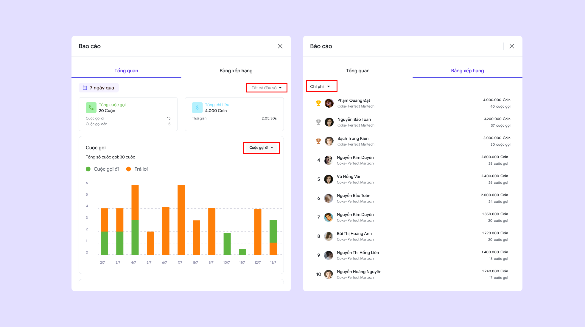

# 🔸 Tổng đài

## I. Giới thiệu tính năng

Tổng đài là tính năng cho phép người dùng quản lý và thực hiện các cuộc gọi đi và đến một cách tập trung, hỗ trợ chăm sóc khách hàng và bán hàng hiệu quả. Hệ thống này tích hợp nhiều chức năng như ghi âm cuộc gọi, và theo dõi hiệu suất theo thời gian thực, giúp cải thiện chất lượng dịch vụ, tối ưu quy trình tương tác với khách hàng.

## II. Hướng dẫn sử dụng

### 1. Kích hoạt gói tổng đài

* **Bước 1:** Chọn "**Kích hoạt gói tổng đài"**
* **Bước 2:** Chọn **"Số tài khoản muốn mua"**
* **Bước 3:** Chọn "**Số tháng muốn sử dụng"**
* **Bước 4:** Thanh toán

<figure><figcaption>
Tổng đài chưa kích hoạt
</figcaption></figure> <figure><figcaption>
Kích hoạt gói tổng đài
</figcaption></figure>

**\*Lưu ý:**&#x20;

* Người dùng cần kích hoạt gói tổng đài để sử dụng tính năng này. Gói tổng đài hiện đang được bán với giá **100.000 Coin/ thành viên/ tháng**.
* &#x20;Hiện tại tất cả các phần trong tổng đài chỉ có thể thanh toán thông qua COKA Coin. [Hướng dẫn nạp COKA Coin](../vi-coka.md#id-2.-nap-tien-vao-vi-coka).

Sau khi thanh toán thành công, tổng đài sẽ được kích hoạt, giờ đây bạn có thể sử dụng tổng đài.&#x20;

<figure><figcaption>
 Tổng đài (đã kích hoạt)
</figcaption></figure>

### 2. Thêm thành viên vào tổng đài

* **Bước 1:** Ấn vào **"Xem chi tiết"**&#x20;
* **Bước 2:** Chọn **"Thêm thành viên"**&#x20;
* **Bước 3:** Tìm thành viên và ấn vào nút **"Thêm"** để thêm thành viê&#x6E;**,** bỏ thành viên bằng cách ấn vào nút **"Loại bỏ"**

<figure><figcaption>
Tài khoản sử dụng tổng đài
</figcaption></figure>

### 3. Mua thêm tài khoản người dùng&#x20;

* **Bước 1:** Chọn **"Mua thêm tài khoản người dùng"**&#x20;
* **Bước 2:** Chọn **"Số tài khoản muốn mua thêm"**
* **Bước 3:** Thanh toán

**Lưu ý:** Thời hạn của tài khoản người dùng sẽ đi cùng với gói kích hoạt ban đầu.&#x20;

<figure><figcaption>
Mua thêm tài khoản người dùng
</figcaption></figure>

### 4. Gia hạn gói tổng đài&#x20;

* **Bước 1:** Chọn **"Gia hạn"**&#x20;
* **Bước 2:** Chọn **"Số tháng muốn gia hạn"**
* **Bước 3:** Thanh toán

**Lưu ý:**&#x20;

* Người dùng có thể gia hạn gói tổng đài của mình kể cả khi chưa hết hạn.&#x20;
* Bạn có thể giảm số lượng tài khoản gia hạn bằng cách [loại bớt](tong-dai.md#id-2.-them-thanh-vien-vao-tong-dai)  một số thành viên khỏi tổng đài. Tuy nhiên, điều này chỉ áp dụng khi gói tổng đài của bạn đã hết hạn. Nếu gói vẫn còn thời hạn, bạn sẽ phải gia hạn cho toàn bộ số chỗ đã mua.

<figure><figcaption>
Gia hạn gói tổng đài
</figcaption></figure>

### 5. Đầu số

Mỗi tài khoản sẽ có **đầu số mặc định**, tuy nhiên nếu người dùng có nhu cầu sử dụng thêm có thể mua thêm các đầu số theo yêu cầu của người dùng.

* **Bước 1:** Nhấn vào **"Mua thêm đầu số"**
* **Bước 2:** Chọn đầu số
* **2.1 Đầu số có sẵn:**&#x20;

**+** Chọn **"Đầu số cố định"** phù hợp với bạn.

**+** Thanh toán&#x20;

* **2.2 Đăng ký đầu số** (Không có đầu số có sẵn phù hợp với nhu cầu)**:**

**+** Chọn **"Đầu số cố định"** mà bạn muốn mua

**+** Bấm vào **"Đăng ký"**. Hệ thống sẽ phản hồi bạn trong thời gian sớm nhất.

<figure><figcaption>
Đầu số
</figcaption></figure>

### 6. Xem chi tiết báo cáo

* **Bước 1:** Chọn **"Xem chi tiết"** để xem báo cáo
* **Bước 2:** Chọn **"Tất cả đầu số"** để lọc đầu số
* **Bước 3:** Chọn **"Cuộc gọi đi"** để đổi sang biểu đồ khác
* **Bước 4**: Chọn tabs **"Bảng xếp hạng"** để xem.
* **Bước 5**: Ấn vào **"Chi phí"** để xem các bảng xếp hạng khác bao gồm: **Chi phí, hiệu quả, thời gian đàm thoại**

<figure><figcaption>
Báo cáo 
</figcaption></figure>

### 7. Lịch sử cuộc gọi

* **Bước 1:** Chọn **"Xem tất cả"** để xem chi tiết lịch sử cuộc gọi
* **Bước 2:** Nhấn vào bất kỳ **"Lịch sử cuộc gọi"** nào để xem chi tiết

<figure><figcaption>
Lịch sử cuộc gọi
</figcaption></figure>
