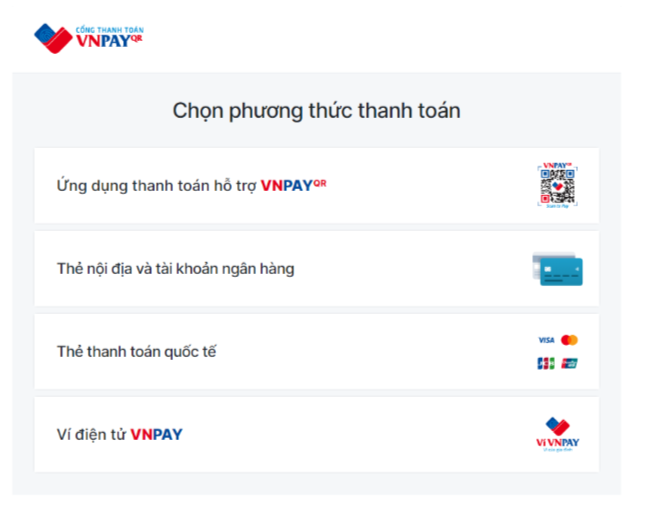
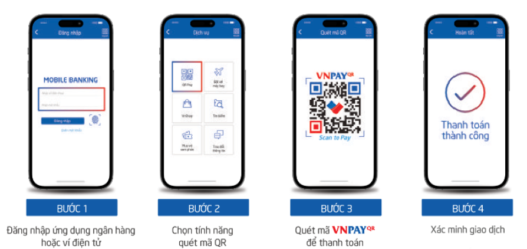
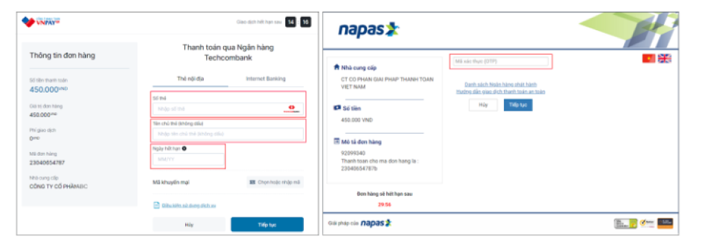

---
layout:
  title:
    visible: true
  description:
    visible: false
  tableOfContents:
    visible: true
  outline:
    visible: true
  pagination:
    visible: true
---

# 🔷 Hướng dẫn thanh toán VNPAY

Cổng thanh toán VNPAY là giải pháp thanh toán do Công ty Cổ phần Giải pháp Thanh toán Việt Nam (VNPAY) phát triển. Khách hàng sử dụng thẻ/tài khoản ngân hàng, tính năng QR Pay/VNPAY-QR được tích hợp sẵn trên ứng dụng Mobile Banking của các ngân hàng hoặc Ví điện tử liên kết để thanh toán các giao dịch và nhập mã giảm giá (nếu có)

## I. Quét mã VNPAY-QR trên 35+ Ứng dụng Mobile Banking và 15+ Ví điện tử liên kết

### Danh sách Ngân hàng/ Ví điện tử có áp dụng khuyến mãi

<figure><figcaption></figcaption></figure>

### Danh sách Ngân hàng/ Ví điện tử khách có hỗ trợ thanh toán VNPAY QR

<figure><figcaption></figcaption></figure>

### 40+ Thẻ ATM/ Nội địa/ Tài khoản ngân hàng

<figure><figcaption></figcaption></figure>

### 4 Thẻ thanh toán quốc tế

<figure><figcaption></figcaption></figure>

## II. Các phương thức thanh toán qua VNPAY

<figure><figcaption></figcaption></figure>

### **1. Phương thức thanh toán qua “Ứng dụng thanh toán hỗ trợ VNPAY-QR”**

* **Bước 1: Quý khách lựa chọn sản phẩm, dịch vụ và chọn Thanh toán ngay hoặc Đặt hàng**

Tại trang thanh toán, vui lòng kiểm tra lại sản phẩm đã đặt, điền đầy đủ thông tin người nhận hàng, chọn phương thức thanh toán VNPAY và nhấn nút “Đặt hàng ngay”.

* **Bước 2: Màn hình thanh toán chuyển sang giao diện cổng thanh toán VNPAY. Chọn phương thức “Ứng dụng thanh toán hỗ trợ VNPAY-QR”**
* **Bước 3: Hệ thống hiển thị mã QR cùng với số tiền cần thanh toán, Quý khách kiểm tra lại số tiền này. Sử dụng ứng dụng ngân hàng (theo danh sách liệt kê), chọn “Quét Mã” và tiến hành quét mã QR trên màn hình thanh toán website**

\*Lưu ý: Mã QR có hiệu lực trong 15 phútĐể quá trình thanh toán thành công, khách hàng vui lòng tham khảo trước các điều kiện và thao tác quét mã trên điện thoại để sẵn sàng, tránh sự cố hết thời gian ảnh hưởng đến thanh toán và mã khuyến mại của quý khách.

* **Bước 4: Kiểm tra thông tin, nhập mã giảm giá (nếu có) và hoàn tất thanh toán**

Khi thực hiện thanh toán hoàn tất Quý khách sẽ nhận được thông báo xác nhận đơn hàng đặt hàng thành công tại website

<figure><figcaption>
<strong>Hướng dẫn thanh toán qua tính năng QR Pay/VNPAY-QR</strong>
</figcaption></figure>

### **2. Phương thức thanh toán qua “Thẻ nội địa và tài khoản ngân hàng”**

* **Bước 1: Quý khách lựa chọn sản phẩm, dịch vụ và chọn Thanh toán ngay hoặc Đặt hàng**

Tại trang thanh toán, vui lòng kiểm tra lại sản phẩm đã đặt, điền đầy đủ thông tin người nhận hàng, chọn phương thức thanh toán VNPAY và nhấn nút “Đặt hàng ngay”.

* **Bước 2: Màn hình thanh toán chuyển sang giao diện cổng thanh toán VNPAY. Chọn phương thức “Thẻ nội địa và tài khoản ngân hàng” và chọn ngân hàng muốn thanh toán thẻ trong danh sách**
* **Bước 3: Quý khách vui lòng thực hiện nhập các thông tin thẻ/tài khoản theo yêu cầu và chọn “Tiếp tục”. Mã OTP sẽ được gửi về điện thoại đăng ký, nhập mã OTP để hoàn tất giao dịch**

\*Lưu ý: Giao dịch sẽ hết hạn sau 15 phút

* **Bước 4: Khi thực hiện thanh toán hoàn tất Quý khách sẽ nhận được thông báo xác nhận đơn hàng đặt hàng thành công tại website**

<figure><figcaption>
<strong>Giao diện thanh toán qua “Thẻ nội địa và tài khoản ngân hàng”</strong>
</figcaption></figure>

### **3. Phương thức thanh toán qua “Thẻ thanh toán quốc tế (Visa, MasterCard, JCB, UnionPay)”**

Tương tự như phương thức thanh toán “Thẻ nội địa và tài khoản ngân hàng”

### **4. Phương thức thanh toán qua “Ví điện tử VNPAY”**

Tương tự như phương thức thanh toán “Ứng dụng thanh toán hỗ trợ VNPAY-QR

### **KÊNH HỖ TRỢ VNPAY**

* Tổng đài: \*3388 hoặc 1900 55 55 77&#x20;
* Zalo OA: [zalo.me/4134983655549474109](https://zalo.me/4134983655549474109)
* Email: [hotro@vnpay.vn](mailto:hotro@vnpay.vn)
* Fanpage: [facebook.com/VNPAYQR.vn](https://facebook.com/VNPAYQR.vn)
