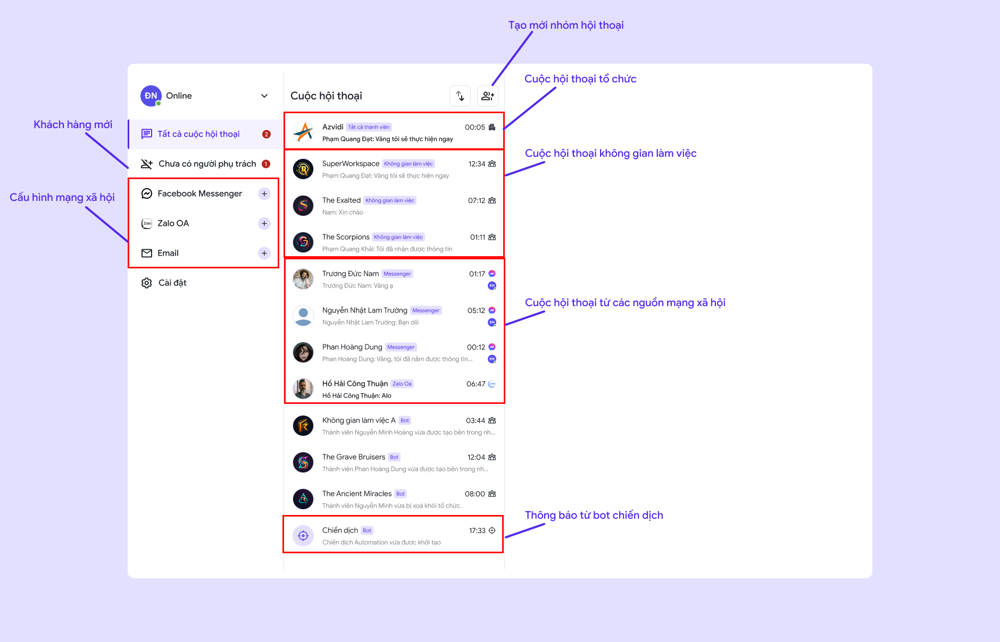
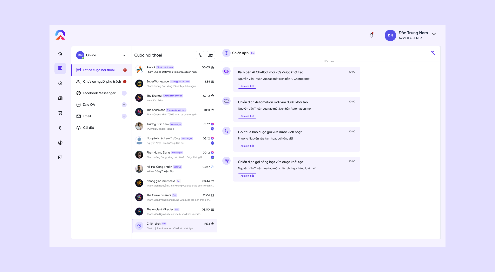

---
layout:
  title:
    visible: true
  description:
    visible: false
  tableOfContents:
    visible: true
  outline:
    visible: true
  pagination:
    visible: true
---

# 🔸 Chat đa kênh

## I. Giới thiệu tính năng

Chat đa kênh là tính năng cho phép người dùng trò chuyện từ các nền tảng khác nhau như Zalo OA, Facebook Messenger, Email trong cùng một giao diện. Ngoài ra, hệ thống còn hỗ trợ trò chuyện trong ứng dụng (in-app chat), giúp các không gian làm việc bên trong tổ chức giao tiếp hiệu quả và liên tục. Tính năng này mang đến trải nghiệm liền mạch cho người dùng và tăng cường khả năng phối hợp nội bộ.&#x20;

Người dùng có thể thấy tất cả các cuộc hội thoại của bản thân bao gồm:

* Cuộc hội thoại chung của tổ chức
* Các nhóm làm việc liên quan
* Bot chiến dịch
* Các khách hàng từ các nguồn như Messenger, Zalo, Email

## II Hướng dẫn sử dụng

<figure><figcaption>
Chat đa kênh
</figcaption></figure>

### 1. Cuộc hội thoại của tổ chức

* Truy cập **cuộc hội thoại tổ chức:** Chọn cuộc hội thoại có nhãn **"tất cả thành viên"** và icon **"tổ chức"**&#x20;

<figure><figcaption>
Cuộc hội thoại tổ chức
</figcaption></figure>

### 2. Không gian làm việc

* Truy cập **cuộc hội thoại không gian làm việc:** Chọn cuộc hội thoại có nhãn **"Không gian làm việc"** và icon **"không gian làm viêc"**&#x20;

<figure><figcaption>
Cuộc hội thoại không gian làm việc
</figcaption></figure>

* Tạo **nhóm chat mới:**

\+  Chọn icon **"Thêm mới"** để tạo nhóm chat mới

\+ **Đặt tên nhóm**

\+ Chọn **"Thành viên"**

\+ Bấm **"Tạo"** để lưu.

<figure><figcaption>
Tạo nhóm chat
</figcaption></figure>

### 3. Từ các nguồn mạng xã hội, Email

* Truy cập **Cuộc hội thoại từ mạng xã hội:** Chọn cuộc hội thoại có nhãn **"Message/ Zalo/ Email"** và icon **"Message/Zalo/Email".**
* **Lưu ý:** Dưới biểu tượng mạng xã hội sẽ hiển thị ảnh đại diện của người phụ trách đoạn tin nhắn này. Nếu có ai đó phản hồi hoặc được phân công quản lý tin nhắn, ảnh đại diện sẽ xuất hiện. Nếu không có người phụ trách, ảnh đại diện sẽ không hiển thị.

<figure><figcaption>
Cuộc hội thoại từ mạng xã hội
</figcaption></figure>

* Ấn vào để xem chi tiết hội thoại:&#x20;

<figure><figcaption>
Khách hàng nhắn tin từ Page
</figcaption></figure>

* **Người phụ trách:**&#x20;

\+ Một khi **có người trả lời** khách hàng **thông qua COKA**, đó sẽ là **người phụ trách**.&#x20;

\+ Ngoài ra **quản trị viên** cũng có thể **phân công cho thành viên** bên trong tổ chức phụ trách

* **Thông tin khách hàng:**

\+ Thông tin cơ bản như: **Avatar, họ tên, email, số điện thoại, ghi chú...**

\+ Trang kết nối: Thông tin trang kết nối. ấn vào để xem **địa chỉ liên kết trang**

\+ Thêm khách hàng: Người dùng có thể thêm trực tiếp khách hàng vào COKA khi đã có các thông tin cơ bản của người này.

**\*Chú ý:** Trong quá trình hội thoại, hệ thống sẽ tự động phát hiện và điền sẵn các thông tin quan trọng như email và số điện thoại. Điều này giúp tiết kiệm thời gian và đảm bảo thông tin luôn được cập nhật nhanh chóng và chính xác.

### 4. Bot chiến dịch

* Truy cập **Bot chiến dịch:** Chọn cuộc hội thoại có nhãn **"Bot"** và icon **"Chiến dịch"**&#x20;

<figure><figcaption>
Bot chiến dịch
</figcaption></figure>

* Bấm xem chi tiết để xem chi tiết chiến dịch:&#x20;

<figure><figcaption>
Bot chiến dịch
</figcaption></figure>

### 5. Hướng dẫn kết nối từ Facebook Messenger, Zalo OA, Email.

#### 1. Facebook Messenger, Zalo OA&#x20;

* Nhấn chọn **"Facebook Messenger"** hoặc" **Zalo OA"** để kết nối trang của bạn với COKA.&#x20;
* Chọn **"Kết nối trang"** để tiếp tục

<figure><figcaption></figcaption></figure>

* Đọc **"Hướng dẫn"** và chọn **"Kết nối với Facebook".**&#x20;

<figure><figcaption></figcaption></figure>

* Hệ thống sẽ chuyển đến giao diện đăng nhập của nền tảng bạn mong muốn, đăng nhập và chọn **trang** mà bạn muốn kết nối.
* Sau khi liên kết thành công, chọn lại trang bên trong COKA
* Bấm "Kết nối" để hoàn tất.

<figure><figcaption></figcaption></figure>

#### 2. Email

* Email sẽ có 2 loại là "**Gmail"** và các loại "**email"** khác.
*   Chọn loại email bạn muốn kết nối và bấm **"Kết nối"**

    <figure><figcaption>
Chọn loại Email
</figcaption></figure>
* Sau khi liên kết thành công, tất cả email gửi đến sẽ được đồng bộ về hệ thống. Bạn có thể bắt đầu quản lý và trả lời email trực tiếp trong ứng dụng.&#x20;
