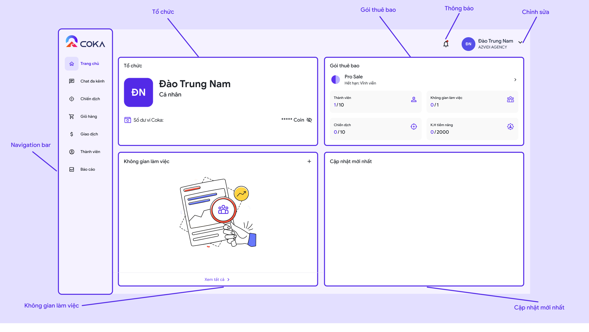

# 🔸 Bước 1: Thiết lập tổ chức

## 1. Giao diện trang chủ của COKA

<figure><figcaption></figcaption></figure>

Các yếu tố và chức năng của từng phần trong trang chủ Quàn trị viên:

* **Tổ chức:** Đây là nơi hiện các thông tin cơ bản của tổ chức của bạn cũng như ví COKA
* **Gói thuê bao:** Là nơi bạn biết được tổ chức của mình đang sử dụng gói thuê bao nào
* **Không gian làm việc:** Bên trong tổ chức sẽ có các không gian làm việc giúp người dùng dễ dàng quản lí, tìm kiếm và chăm sóc khách hàng, đội nhóm của mình
* **Cập nhật mới nhất:** Nơi đây sẽ tổng hợp các hoạt động bên trong tổ chức như: thêm, xoá thành viên, thay đổi chỉnh sửa...
* **Navigation bar:** Thanh điều hướng dẫn người dùng đến các tính năng khác bên trong COKA
* **Thông báo:** Tất cả thông báo liên quan đến người dùng
* **Chỉnh sửa:** Chỉnh sửa cũng như sử dụng các phím tắt của ứng dụng

## 2. Thiết lập cơ bản cho tổ chức mới

Tổ chức giúp người khác dễ dàng tìm kiếm tổ chức của bạn và gia nhập hơn. Hãy chắc chắn bạn điền đầy đủ thông tin quan trọng giúp người dùng khác có thể tìm kiếm chính xác tổ chức của bạn. Ấn vào phần tuỳ chỉnh ở góc phải màn hình và chọn "Chuyển đổi tổ chức" , sau đó chọn "Tạo tổ chức mới" .

<figure><figcaption>
Chuyển đổi tổ chức
</figcaption></figure> <figure><figcaption>
Tạo tổ chức mới
</figcaption></figure>

Điền đầy đủ thông tin cho tổ chứ của bạn

<figure><figcaption>
Màn tạo tổ chức mới
</figcaption></figure>

Sau khi hoàn tất bấm lưu và bạn đã tạo tổ chức mới thành công

<figure><figcaption>
Tổ chức đầy đủ thông tin
</figcaption></figure>

