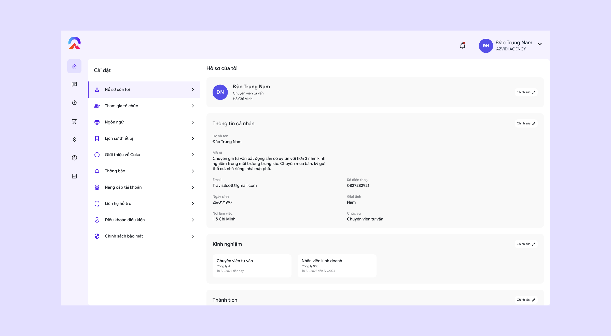

# 🔸 Bước 1: Chỉnh sửa thông tin cá nhân và gia nhập tổ chức

## 1. Chỉnh sửa thông tin cá nhân

Ấn vào tuỳ chỉnh chọn phần cài đặt

<figure><figcaption></figcaption></figure>

<figure><figcaption></figcaption></figure>

Chỉnh sửa bất cứ thông tin nào bạn muốn để có một hồ sơ cá nhân chuyên nghiệp hơn

## 2. Yêu cầu gia nhập tổ chức

Sau khi đã có một hồ sơ cá nhân chuyên nghiệp, giờ bạn có thể tìm kiếm và yêu cầu gia nhập vào tổ chức. Ấn vào phần tuỳ chỉnh chọn tham gia tổ chức.

<figure><figcaption></figcaption></figure>

Ở tham gia tổ chức sẽ có 2 phần đó là tham gia và lời mời

* Tham gia: Bạn có thể tìm kiếm và gửi yêu cầu gia nhập đến tổ chức bạn muốn
* Lời mời: Những lời mời từ các tổ chức khác gửi đến bạn

<figure><figcaption>
Tham gia tổ chức
</figcaption></figure> <figure><figcaption>
Lời mời vào tổ chức
</figcaption></figure>

