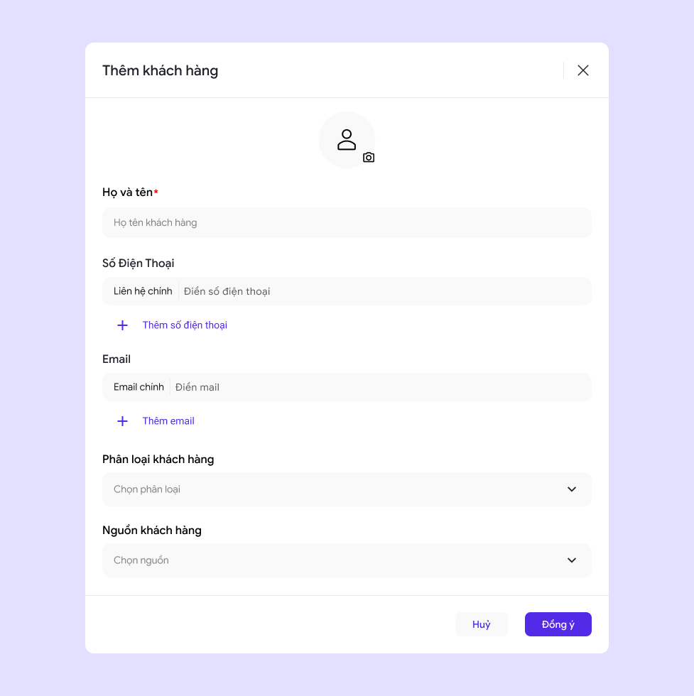

# 🔸 Bước 2: Gia nhập không gian làm việc và bắt đầu tìm kiếm khách hàng đầu tiên của bạn

## Thêm khách hàng&#x20;

Ấn vào FAB **"Thêm"** và chọn các hình thức bạn muốn thêm

<figure><figcaption></figcaption></figure>

\*Thành viên trong không gian làm việc có thể thêm khách hàng thông qua 3 hình thức :

* **Thủ công:** Tạo khách hàng mới bằng cách điền các thông tin cơ bản của khách hàng
* **Google Sheet:** Nhập số lượng lớn khách hàng thông qua Google Sheet
* **Kết nối đa nguồn:** Tìm kiếm khách hàng thông qua việc kết nối nhiều nguồn như Web form, Facebook Messenger, Zalo OA.... Xem hướng dẫn [tại đây](../chien-dich-cua-coka/ket-noi-da-nguon.md).

<figure><figcaption>
Thêm thủ công
</figcaption></figure> <figure><figcaption>
Thông qua Google Sheet
</figcaption></figure>

