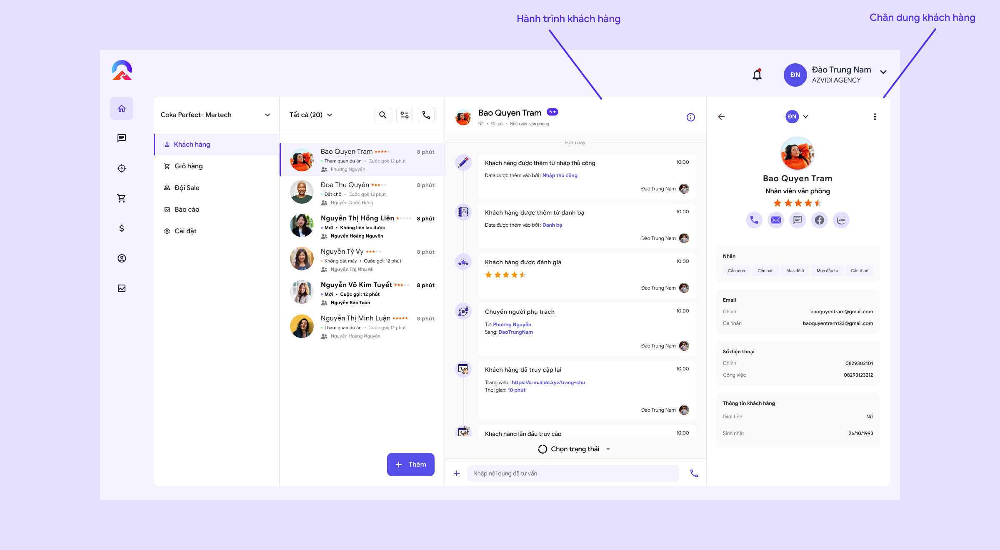

# 🔸 Bước 3: Chăm sóc, theo dõi và quản lý khách hàng với COKA

## 1. Theo dõi và quản lý khách hàng&#x20;

Khi bạn chọn xem chi tiết của bất kỳ khách hàng nào, hệ thống sẽ hiển thị toàn bộ hành trình khách hàng cùng với chân dung khách hàng một cách trực quan.

<figure><figcaption></figcaption></figure>

1. Hành trình khách hàng: Người dùng có thể theo dõi, cập nhật tình hình, trạng thái khách hàng của mình bên trong ứng dụng thông qua hành trình khách hàng. Ứng dụng có thể theo dõi, Tracking  lịch sử hoạt động, tương tác giữa người dùng và khách hàng . Các hoạt động bên trong hành trình khách hàng thường bao gồm:
   * Khách hàng được thêm vào từ: Thủ công, danh bạ, từ bot, kết nối đa nguồn...
   * Một số hoạt động khách hàng: Đã truy cập vào website, tương tác điền form...
   * Các hoạt động giữa người dùng và khách hàng: Tư vấn qua tin nhắn, email, cập nhật trạng thái, đánh giá khách hàng...
2. Chân dung khách hàng: Nơi đây người dùng có thể rõ ràng nhìn thấy chân dung khách hàng của mình với đầy đủ các thông tin, mạng xã hội... Ngoài ra ứng dụng có tính năng "[Làm đầy dữ liệu](../chien-dich-cua-coka/lam-giau-du-lieu.md)" giúp việc hoàn thành chân dung khách hàng của bạn trở nên tự động. Xem thêm làm đầy dữ liệu [tại đây](../chien-dich-cua-coka/lam-giau-du-lieu.md).

## 2. Chăm sóc khách hàng

Ngoài các công việc chăm sóc khách hàng thông thường , hệ thống còn tích hợp nhiều tính năng khác như [Ai Chatbot](../chien-dich-cua-coka/ai-chatbot.md), [Automation](../chien-dich-cua-coka/automation.md), [Tổng đài](../chien-dich-cua-coka/tong-dai.md).. để hỗ trợ người dùng chăm sóc khách hàng một cách tự động, chính xác và hiệu quả hơn.&#x20;

* Ai Chatbot: Tại đây người dùng có thể tạo nhiều kịch bản chăm sóc khách hàng, với ngôn ngữ tự nhiên, thân thiện. Chatbot có thể thay thế người dùng chăm sóc cho khách hàng một cách tự động. [Xem thêm](../chien-dich-cua-coka/ai-chatbot.md)
* Automation: Với nhiều kịch bản tự động khác nhau, người dùng có thể cấu hình theo ý mình giúp công việc trở nên 1 cách tự động hơn. [Xem thêm](../chien-dich-cua-coka/automation.md)
* Tổng đài: Tổng đài giúp người dùng dễ dàng liên lạc với khách hàng thông qua ứng dụng. Ngoài ra tích hợp các thống kê, kịch bản chăm sóc khách hàng, quay số hàng loạt.... [Xem thêm](../chien-dich-cua-coka/tong-dai.md)

## 3. Cập nhật trạng thái khách hàng

Chọn và "**nhập nội dung tư vấn"** sau đó chọn "**trạng thái"** và bấm "**xác nhận"**.

<figure><figcaption>
Cập nhật trạng thái
</figcaption></figure>
