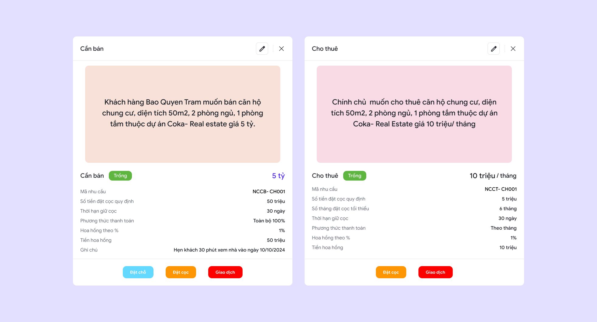

---
layout:
  title:
    visible: true
  description:
    visible: false
  tableOfContents:
    visible: true
  outline:
    visible: true
  pagination:
    visible: true
---

# 🔸 Bước 4: Khám phá sản phẩm và nhu cầu của khách hàng

## 1. Khám phá sản phẩm

Sản phẩm là nơi người dùng có thể xem tất cả sản phẩm ở đây bao gồm các loại bất động sản riêng lẻ và bất động sản dự án. Bên trong các sản phẩm có đầy đủ các chi tiết như giá bán, giá thuê, đặc điểm, chính chủ, và đặc biệt là nhu cầu của sản phẩm.&#x20;

### 1.1 Xem chi tiết sản phẩm

Chọn **1 sản phẩm** để xem chi tiết sản phẩm:

<figure><figcaption>
Chi tiết sản phẩm
</figcaption></figure>

Màn hình chi tiết sản phẩm sẽ bao gồm:

* Tên, địa chỉ, các thông tin, đặc điểm, giá gốc của sản phẩm.&#x20;
* Dự án của sản phẩm nếu có&#x20;
* Thông tin chính chủ.&#x20;
* Nhu cầu của sản phẩm này.

### 1.2 Tạo sản phẩm

Nếu bạn được cấp đủ quyền, bạn cũng có thể tạo sản phẩm bằng cách bấm vào nút thêm sản phẩm&#x20;

<figure><figcaption>
Tạo sản phẩm
</figcaption></figure>

Thực hiện đầy đủ các bước để tạo sản phẩm.

<figure><figcaption>
Các bước tạo sản phẩm
</figcaption></figure>

## 2. Nhu cầu của sản phẩm

Mỗi sản phẩm sẽ những nhu cầu riêng, nhu cầu sẽ có hai loại:

* **Cần bán**&#x20;
* **Cho thuê**

Sales có thể dễ dàng thực hiện các thao tác như đặt chỗ đặt cọc hay giao dịch bên trong những nhu cầu này.

<figure><figcaption>
Chi tiết cần bán và cho thuê của sản phẩm
</figcaption></figure>

### Tạo mới nhu cầu

Nhấn vào nút **"Tạo mới"** và điền đầy đủ các thông tin cần thiết.

<figure><figcaption>
Tạo mới nhu cầu
</figcaption></figure>


Bạn đã hoàn thành cơ bản các bước cơ bản của thành viên. Bạn có thể tìm hiểu thêm về [vai trò quản trị viên](../vai-tro-quan-tri-vien/), [chiến dịch ](../chien-dich-cua-coka/)và các [tiện ích](../tien-ich-cua-coka/) khác của COKA.

